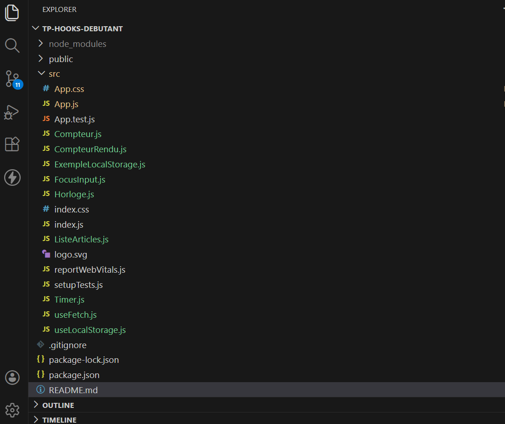
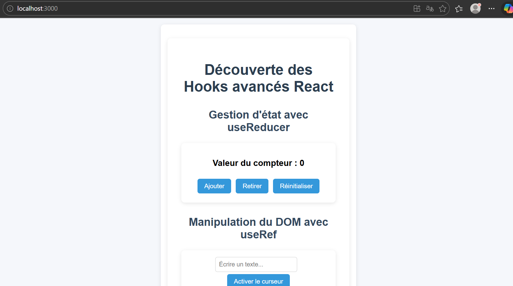
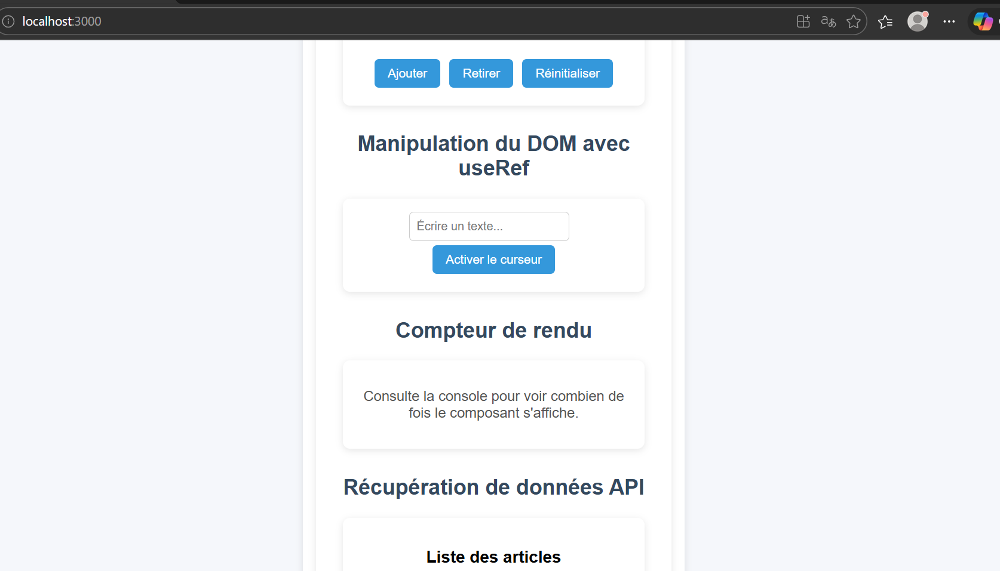
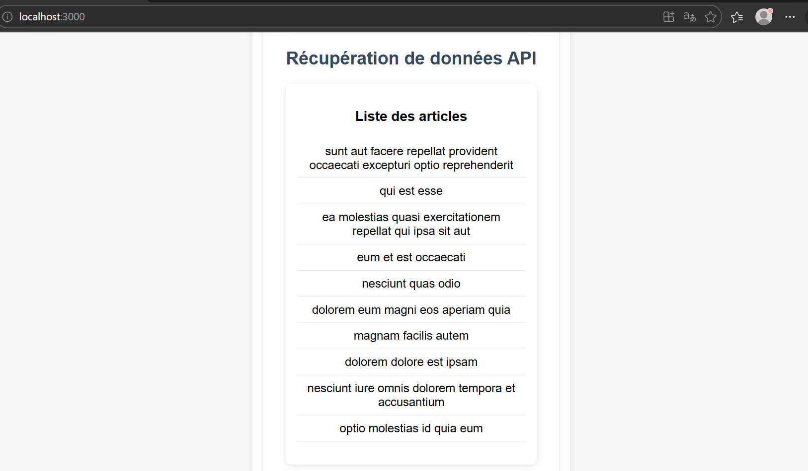
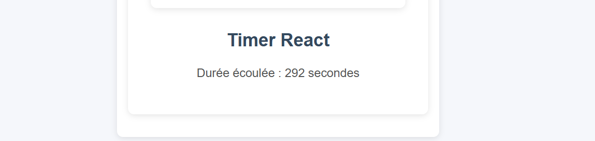

# TP 6 — Découverte des Hooks Avancés et des Hooks Personnalisés

## 📚 Cours
Développement Front-End moderne avec React

---

## Contexte

#### Ce TP s'inscrit dans la continuité du cours Développement Front-End moderne avec React.  
#### Il permet de découvrir et de mettre en pratique plusieurs Hooks avancés de React ainsi que la création d’un Hook personnalisé.
#### Le but est de comprendre comment gérer un état plus structuré avec useReducer, manipuler directement le DOM avec useRef, utiliser useEffect avec une fonction de nettoyage, et créer un Hook personnalisé pour réutiliser une logique dans plusieurs composants.

---

## Objectifs

#### - Comprendre l'utilisation du Hook useReducer pour gérer un état complexe
#### - Manipuler des éléments du DOM avec useRef
#### - Utiliser useEffect pour gérer des effets secondaires dans un composant
#### - Implémenter une fonction de nettoyage dans useEffect
#### - Créer et utiliser un Hook personnalisé
#### - Organiser plusieurs composants React dans une application

---

## Technologies utilisées

#### - React 18
#### - JavaScript
#### - JSX
#### - Hooks React (useReducer, useRef, useEffect)
#### - CSS personnalisé

---

## 📁 Structure du projet

---

## Installation et lancement

#### - Cloner le projet :

#### git clone https://github.com/nassima-brina/TP-6-D-couverte-des-Hooks-Avanc-s-et-des-Hooks-Personnalis-s/tree/main

#### - Entrer dans le dossier :

#### cd tp-hooks-debutant

#### - Installer les dépendances :

#### npm install

#### - Lancer le serveur de développement :

#### npm start

#### L'application s'ouvre sur : http://localhost:3000

---

## Composants créés

### Compteur.js
#### Composant utilisant le Hook useReducer pour gérer un compteur. Il permet d’incrémenter et de décrémenter une valeur en fonction de l’action envoyée au reducer.

### FocusInput.js
#### Composant qui utilise useRef pour accéder directement à un champ de texte et placer automatiquement le curseur dans l’input lorsqu’un bouton est cliqué.

### CompteurRendu.js
#### Composant qui utilise useRef et useEffect pour compter combien de fois le composant a été rendu et afficher cette information dans la console du navigateur.

### useFetch.js
#### Hook personnalisé permettant de récupérer des données depuis une API externe. Il gère les états de chargement, d’erreur et de données reçues.

### ListeArticles.js
#### Composant qui utilise le Hook personnalisé useFetch pour récupérer et afficher une liste d’articles provenant d’une API externe.

### Timer.js
#### Composant utilisant useEffect et setInterval pour afficher un compteur de temps qui s'incrémente chaque seconde, avec un nettoyage automatique de l'intervalle.

---

## Aperçu de l'application

#### L'application affiche :

#### - Un compteur utilisant le Hook useReducer
#### - Un champ texte avec focus automatique grâce à useRef
#### - Un compteur de rendus affiché dans la console
#### - Une liste d’articles récupérée depuis une API externe
#### - Un timer affichant le temps écoulé en secondes

---

## Conclusion

#### Ce sixième TP m'a permis de comprendre et d'utiliser plusieurs Hooks avancés de React :
#### - L'utilisation de useReducer pour structurer la gestion d'un état
#### - L'utilisation de useRef pour manipuler directement le DOM
#### - L'utilisation de useEffect pour gérer des effets secondaires dans un composant
#### - La création d'un Hook personnalisé pour réutiliser une logique dans plusieurs composants
#### - L'organisation d'une application React en plusieurs composants réutilisables
